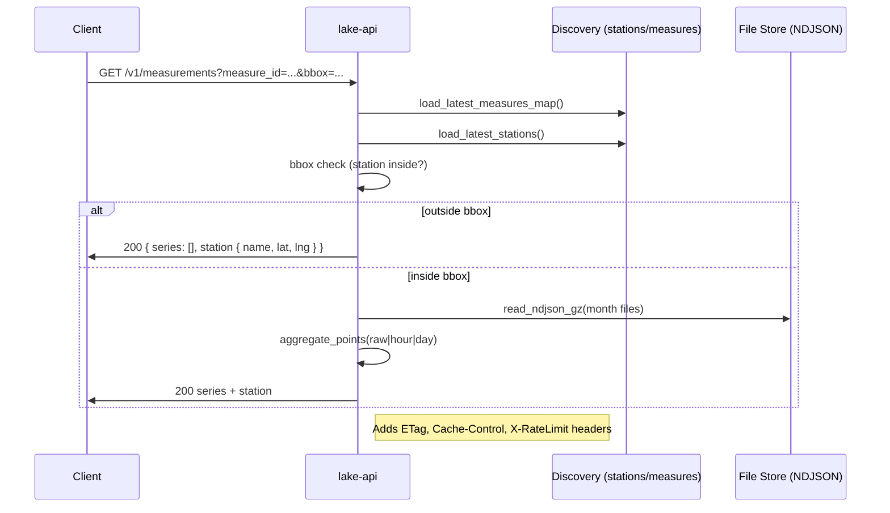

# Flood Watch Data Lake

Data ingestion and API for UK flood monitoring, curated polygons, and time‑series access.

## Overview
- Services
  - lake-worker: runs ingestion and backfill jobs
  - lake-api: FastAPI service serving Data Lake endpoints
- Sources
  - Environment Agency Flood Monitoring (hydrology, rainfall, flood zones, RSE)
- Data layout
  - Raw readings: data/raw/ea/readings/{measure_id}/{YYYY}-{MM}.ndjson.gz
  - Discovery outputs: data/raw/ea/stations/*.ndjson.gz; data/raw/ea/measures/*.ndjson.gz
  - Curated polygons: data/curated/ea/*.geojson

## Prerequisites
- Docker Desktop installed (macOS, Apple Silicon supported)

## Quick Start
- Start services:
  - make up
- Tail logs:
  - make logs-worker
  - make logs-api
- Restart API:
  - make restart-api

## Collect Data
- Run collector (month range and region):
  - FROM=YYYY-MM TO=YYYY-MM REGION=SOM MAX_STATIONS=1 MAX_MEASURES=1 ./scripts/run-collector.sh
- Makefile shortcut:
  - FROM=YYYY-MM TO=YYYY-MM REGION=SOM make collector
- Notes
  - Idempotent writes per slice
  - Re-run same slice to resume after interruptions

## API
- Base: lake-api (Uvicorn) started by docker compose
- Health:
  - GET /healthz
- Polygons:
  - GET /v1/polygons?dataset=flood_zones&region=SOM&inline=true&bbox=w,s,e,n
  - GET /v1/polygons/tiles/{dataset}/{z}/{x}/{y}?region=SOM
- Measurements:
  - GET /v1/measurements?measure_id={id}&from=YYYY-MM-DDTHH:MM:SSZ&to=YYYY-MM-DDTHH:MM:SSZ&aggregate=raw|hour|day&page=1&limit=500
- Rate limits and caching:
  - In‑process TTL cache; per‑IP quotas

## Architecture Diagrams

### System Overview

```mermaid
graph LR
  EA[(Environment Agency APIs)]
  Worker[lake-worker]
  Raw[data/raw/**]
  Curated[data/curated/**]
  API[lake-api (FastAPI)]
  Clients[Clients]

  EA --> Worker
  Worker --> Raw
  Worker --> Curated
  Raw --> API
  Curated --> API
  Clients --> API
  API --> Clients

  subgraph API Internals
    RL[X-RateLimit headers]
    TTL[Cache-Control TTL + ETag]
  end
  API --> RL
  API --> TTL
```

### Measurements Request Flow (bbox-aware)



### Polygons Flow (inline and tiles)

```mermaid
flowchart TD
  C[Client] -->|GET /v1/polygons| A[lake-api]
  A -->|open curated file| Cur[data/curated/ea/...geojson]
  A -->|inline=true| Filter[filter by bbox (small only)]
  A -->|tiles| Tile[compute tile bbox and filter]
  A --> Cache[cache_set + ETag + TTL]
  Cache --> C
```

## Storage Sizing

- Drivers
  - Raw readings NDJSON per measure per month at data/raw/ea/readings/{measure}/{YYYY}-{MM}.ndjson.gz
  - Discovery dumps (stations, measures) at data/raw/ea/stations/*.ndjson.gz and data/raw/ea/measures/*.ndjson.gz
  - Curated polygons GeoJSON at data/curated/ea/**
  - Logs for worker/API containers

- Rule‑of‑Thumb
  - Hydrology readings: ~0.2 MB per measure per month (15‑min cadence, gzipped)
  - Stations snapshot: ~5–20 MB gz
  - Measures snapshot: ~3–15 MB gz
  - Flood Zones per region (simplified): ~20–80 MB
  - RSE per scenario per region: ~10–60 MB

- Formulas
  - Hydrology total ≈ 0.2 MB × measures × months; months = years × 12
  - Discovery total ≈ (stations + measures per snapshot) × snapshots retained
  - Polygons total ≈ sum(region flood_zones) + sum(region × scenarios RSE)

- Examples
  - 1 region, 500 measures, 5 years → hydrology ≈ 6 GB; polygons ≈ 60–320 MB; discovery ≈ 40–70 MB; total ≈ 6.1–6.3 GB
  - 5 regions, 2,000 measures, 10 years → hydrology ≈ 48 GB; polygons ≈ 0.3–1.6 GB; discovery ≈ 0.2–0.5 GB; total ≈ 49–51 GB
  - API‑only with curated polygons → ~0.35–1.7 GB

- Control Footprint
  - Scope by region and parameters (level, flow)
  - Limit backfill windows (FROM/TO)
  - Retain minimal discovery snapshots
  - Prefer simplified polygons when suitable
  - Use MAX_STATIONS and MAX_MEASURES to throttle runs

## Cloudflare Hosting (R2 + CDN)

- Overview
  - Store datasets in Cloudflare R2 (public bucket or behind CDN)
  - Serve lake-api as stateless compute (Railway/Fly) reading files over HTTP

- Configure API to read curated polygons remotely
  - Set REMOTE_BASE_URL to the public base that contains curated files
    - Example: https://cdn.example.com/ea
  - File layout expectation
    - Local: data/curated/ea/{region}_{scenario_or_fz2_3}_{simplified|normalized}.geojson
    - Remote: {REMOTE_BASE_URL}/ea/{region}_{scenario_or_fz2_3}_{simplified|normalized}.geojson
  - Behavior
    - If local file exists, it is used
    - If local file is missing and REMOTE_BASE_URL is set, API fetches via HTTP
    - Endpoints: /v1/polygons and /v1/polygons/tiles/… support remote loading

- Notes
  - Prefer simplified files for lower latency and CDN cache friendliness
  - Keep strong caching via ETag and Cache-Control; put CDN in front for free/cheap egress
  - Raw NDJSON can also be hosted the same way; a similar adapter can be added later if needed

## Testing
- API tests (inside lake-api container):
  - make test-api
- Ingestion tests (inside lake-worker container):
  - make test

## CI
- CI uses Docker targets to run tests on push

## Documentation
- Roadmap: [docs/ROADMAP.md](docs/ROADMAP.md)
- Changelog: [docs/CHANGELOG.md](docs/CHANGELOG.md)
- OpenAPI: [docs/openapi-data-lake.yaml](docs/openapi-data-lake.yaml)
- Architecture: [docs/architecture-plan.md](docs/architecture-plan.md)
- Data Sources: [docs/data-sources.md](docs/data-sources.md)
- Project Brief: [docs/project-brief.md](docs/project-brief.md)
- Agents: [AGENTS.md](AGENTS.md)

## API Examples
- Measurements (raw)
  
  ```bash
  curl "http://localhost:8000/v1/measurements?measure_id=TESTMEASURE&from=2026-03-10T00:00:00Z&to=2026-03-10T02:00:00Z&aggregate=raw&limit=100"
  ```

- Measurements (hourly)
  
  ```bash
  curl "http://localhost:8000/v1/measurements?measure_id=TESTMEASURE&from=2026-03-10T00:00:00Z&to=2026-03-10T02:00:00Z&aggregate=hour&limit=100"
  ```

- Polygons (inline metadata + small bbox)
  
  ```bash
  curl "http://localhost:8000/v1/polygons?dataset=flood_zones&region=SOM&format=simplified&inline=true&bbox=-3.90,50.90,-2.20,51.40"
  ```

- Polygons tiles (Web Mercator)
  
  ```bash
  curl "http://localhost:8000/v1/polygons/tiles/flood_zones/10/511/340?region=SOM&format=simplified"
  ```

- Warnings (with geometry; min severity = Flood Alert)
  
  ```bash
  curl "http://localhost:8000/v1/warnings?region=SOM&min_severity=3"
  ```
 
- Warnings (county filter, no region)
  
  ```bash
  curl "http://localhost:8000/v1/warnings?county=Somerset&min_severity=2"
  ```
 
- Warnings (bbox filter)
  
  ```bash
  curl "http://localhost:8000/v1/warnings?bbox=-3.00,50.90,-2.50,51.20&min_severity=3"
  ```
