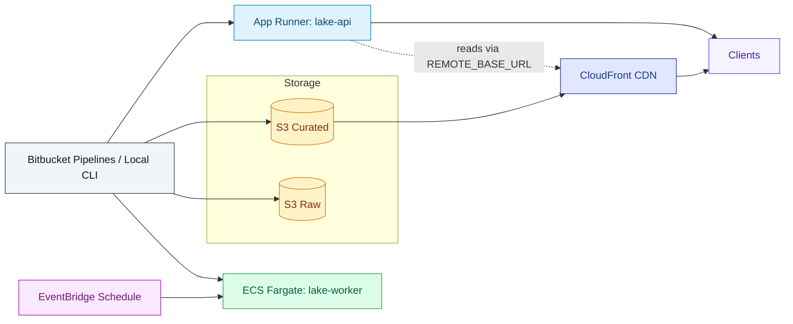

# AWS Deployment (Terraform)

## Overview
- Goal: run lake-api over HTTPS, backfills via lake-worker, and serve curated files via S3 + CloudFront.
- Provisioning: Terraform definitions at [infra/aws/terraform](file:///Users/mike/Projects/flood-watch-data-lake/infra/aws/terraform).
- Deploy flow: push API/worker images to ECR → apply Terraform → point DNS to CloudFront → verify.

## Architecture



## What Terraform Provisions
- S3 buckets
  - Curated: versioned; public access blocked; CloudFront OAC allowed to read
  - Raw: private; public access fully blocked
- CloudFront distribution (Origin Access Control) in front of Curated bucket
  - Custom alias: your cdn_domain_name; ACM cert in us-east-1
- App Runner service for lake-api
  - Pulls ECR image; sets REMOTE_BASE_URL to https://{cdn_domain}/ea and TTL/rate-limits
- ECS Fargate for lake-worker
  - Task definition using your worker image; CloudWatch Logs group
  - EventBridge schedule to RunTask periodically
- ECR repositories for api and worker (if you choose to use them)

Files:
- Main: [main.tf](file:///Users/mike/Projects/flood-watch-data-lake/infra/aws/terraform/main.tf)
- Variables: [variables.tf](file:///Users/mike/Projects/flood-watch-data-lake/infra/aws/terraform/variables.tf)
- Example vars: [terraform.tfvars.example](file:///Users/mike/Projects/flood-watch-data-lake/infra/aws/terraform/terraform.tfvars.example)

## Prerequisites
- AWS CLI with an account profile that can manage S3, CloudFront, App Runner, ECS, ECR, IAM, and EventBridge.
- A DNS name for the CDN (e.g., cdn.example.com) and an ACM certificate for that name in us-east-1.
- Docker for building images.

## Prepare Images (ECR)

```bash
AWS_REGION=eu-west-2
AWS_ACCOUNT_ID=$(aws sts get-caller-identity --query Account --output text)

aws ecr create-repository --repository-name floodwatch-api || true
aws ecr create-repository --repository-name floodwatch-worker || true

aws ecr get-login-password --region $AWS_REGION | docker login \
  --username AWS --password-stdin $AWS_ACCOUNT_ID.dkr.ecr.$AWS_REGION.amazonaws.com

docker build -t floodwatch-api -f Dockerfile .
docker tag floodwatch-api:latest $AWS_ACCOUNT_ID.dkr.ecr.$AWS_REGION.amazonaws.com/floodwatch-api:main
docker push $AWS_ACCOUNT_ID.dkr.ecr.$AWS_REGION.amazonaws.com/floodwatch-api:main

docker build -t floodwatch-worker -f Dockerfile .
docker tag floodwatch-worker:latest $AWS_ACCOUNT_ID.dkr.ecr.$AWS_REGION.amazonaws.com/floodwatch-worker:main
docker push $AWS_ACCOUNT_ID.dkr.ecr.$AWS_REGION.amazonaws.com/floodwatch-worker:main
```

## Configure Terraform Variables

```bash
cd infra/aws/terraform
cp terraform.tfvars.example terraform.tfvars
```

Set:
- aws_region: e.g., eu-west-2
- project_name: e.g., floodwatch-data-lake
- cdn_domain_name: your CDN hostname
- acm_certificate_arn: us-east-1 cert for the CDN name
- api_image_identifier, worker_image_identifier: ECR image:tag URIs
- vpc_id, private_subnet_ids, ecs_security_group_id: networking for ECS tasks
- worker_schedule_expression: e.g., rate(1 day)

Networking note:
- If using public subnets without NAT, set assign_public_ip to ENABLED in the worker network config in [main.tf](file:///Users/mike/Projects/flood-watch-data-lake/infra/aws/terraform/main.tf).

## Apply Terraform

```bash
terraform init
terraform plan -var-file=terraform.tfvars
terraform apply -var-file=terraform.tfvars
```

Outputs:
- s3_curated_bucket, s3_raw_bucket
- cloudfront_domain_name
- apprunner_service_url

## DNS
- Create a CNAME from your cdn_domain_name to cloudfront_domain_name (output).

## Verify
- API: curl the App Runner URL

```bash
curl "$(terraform output -raw apprunner_service_url)/healthz"
```

- Polygons via CDN: https://cdn.example.com/ea/SOM_undefended_1in1000_simplified.geojson

## Trigger a Worker Ad Hoc
- Update the ECS task definition command if you need a specific backfill range or run an on-demand task from the console/CLI.

## Cost & Ops Tips
- Keep polygons simplified for CDN performance and lower egress.
- Lifecycle policies for raw S3 to transition older months to infrequent access.
- Start with small App Runner resources; scale on observed load.

## Troubleshooting
- 403 from S3 via CDN: confirm OAC policy and that the S3 bucket policy trusts the CloudFront distribution ARN.
- App Runner cannot pull image: verify ECR image exists and the App Runner ECR access role is attached.
- ECS fails outbound: confirm subnets have NAT or assign_public_ip is enabled for the task.

## Clean Up

```bash
terraform destroy -var-file=terraform.tfvars
```

## AWS Study Checklist

- IAM and CLI
  - [ ] Create an IAM user with programmatic access
  - [ ] Attach least‑privilege S3 policies (read curated; write raw if needed)
  - [ ] Configure aws configure and verify aws sts get-caller-identity
- S3 Basics
  - [ ] Create a test bucket for curated data
  - [ ] Upload a sample file into ea/ and retrieve it over HTTPS
  - [ ] Add a temporary public‑read bucket policy for testing or use presigned URLs
  - [ ] Add a lifecycle rule to transition old objects to infrequent access
- EC2 Quick Start
  - [ ] Launch a t2.micro/t3.micro in your region
  - [ ] Security Group: allow SSH from your IP; allow TCP 8000 for testing
  - [ ] Install Docker/Compose and run lake‑api
  - [ ] Set REMOTE_BASE_URL to your S3 bucket URL and verify /healthz and /v1/polygons
- Caching & Headers
  - [ ] Inspect ETag and Cache‑Control from responses
  - [ ] Re‑request with If‑None‑Match to see 304 behavior
- Optional: CloudFront (CDN)
  - [ ] Request ACM certificate in us‑east‑1 for cdn.yourdomain
  - [ ] Create a distribution with Origin Access Control to your S3 bucket
  - [ ] Point a CNAME to CloudFront and set REMOTE_BASE_URL to the CDN URL
- Optional: App Runner (Managed API)
  - [ ] Build/push API image to ECR and create an App Runner service
  - [ ] Set env vars (REMOTE_BASE_URL, TTLs, RL limits), test /healthz
- Optional: ECS + EventBridge (Worker)
  - [ ] Define an ECS Fargate task from the worker image
  - [ ] RunTask ad‑hoc with FROM/TO/REGION; add an EventBridge schedule
- Terraform Dry Run
  - [ ] Copy terraform.tfvars.example to terraform.tfvars with placeholders
  - [ ] terraform init and terraform plan to review resources and projected changes
  - [ ] Destroy after testing: terraform destroy
