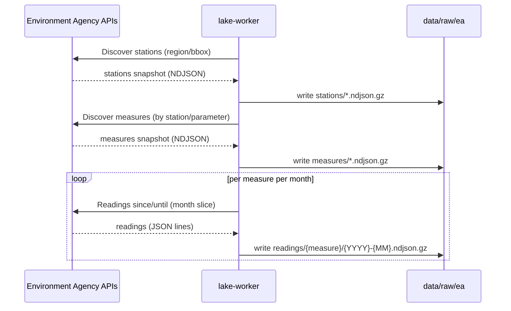
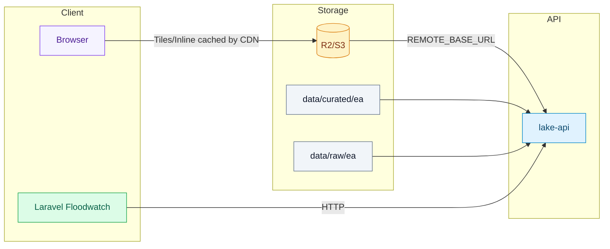
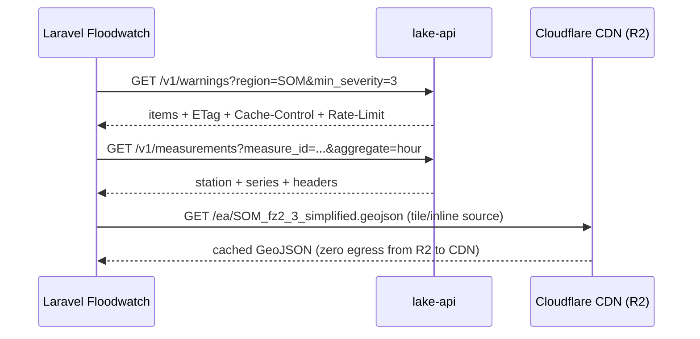

# Data Sources, Processing, and Integration (with Mermaid)

## Acquisition (EA → Raw)

This flow shows lake-worker talking to the Environment Agency APIs to discover stations and measures, then fetching month‑sliced readings for each measure. Results are written as gzipped NDJSON under data/raw/ea for reproducible, idempotent backfills.



## Curation (Raw → Curated)

This flow turns raw snapshots into map‑friendly layers and features. We parse and normalize stations/measures/readings, apply quality flags and rollups, and fetch Flood Zones/RSE polygons which we normalize and simplify. Outputs are stored as curated GeoJSON under data/curated/ea.

```mermaid
flowchart TD
  A[data/raw/ea/stations] --> B[Parse/normalize stations]
  A2[data/raw/ea/measures] --> C[Parse/normalize measures]
  A3[data/raw/ea/readings/*] --> D[Quality flags & rollups]

  E[Fetch Flood Zones & RSE] --> F[Normalize]
  F --> G[Simplify geometries]

  D --> H[Curated features (future: DB/PostGIS)]
  G --> I[data/curated/ea/*.geojson]
```

Notes
- Raw: month‑sliced gz NDJSON for hydrology; snapshots for stations/measures
- Curated: normalized and simplified GeoJSON for web maps (flood_zones, rse)

## Serving (API + CDN)

This flow shows how lake-api serves data to clients. The API reads curated polygons and raw readings from local disk when present, or fetches them from object storage via REMOTE_BASE_URL. A CDN in front of object storage accelerates tiles/inline fetches, while the API returns ETag and TTL headers for efficient client caching.



Behavior
- Polygons: API reads local curated GeoJSON or fetches via REMOTE_BASE_URL; tiles and inline return FeatureCollections with ETag/TTL
- Measurements: API reads local gz NDJSON or fetches via REMOTE_BASE_URL; returns raw/hour/day series with station context
- Warnings: API normalizes EA warnings and enriches geometry where available

## External Usage (Typical Calls)

This flow illustrates how an external service (Laravel Floodwatch) consumes the API and CDN. The app calls warnings and measurements endpoints and respects ETag/Cache‑Control headers; it can also fetch curated polygons directly via the CDN for tiles or inline display.



## Configuration

- REMOTE_BASE_URL: base URL for curated and readings files (e.g., https://cdn.yourdomain/ea)
- TTLs: POLYGONS_TTL, WARNINGS_TTL, MEASUREMENTS_TTL
- Rate limits: RL_LIMIT, RL_WINDOW_S

See also
- Hosting options: docs/hosting-options.md
- OpenAPI: docs/openapi-data-lake.yaml

## Client Examples

Laravel (Http)

```php
use Illuminate\Support\Facades\Http;

$base = env('LAKE_BASE_URL');
$etag = cache('warnings:etag');
$res = Http::withHeaders([
  'If-None-Match' => $etag ?: ''
])->get($base.'/v1/warnings', [
  'region' => 'SOM',
  'min_severity' => 3
]);
if ($res->status() === 304) {
  $body = cache('warnings:body');
} else {
  $body = $res->json();
  cache(['warnings:body' => $body], 300);
  $newEtag = $res->header('ETag');
  if ($newEtag) {
    cache(['warnings:etag' => $newEtag], 300);
  }
}
```

Laravel (measurements)

```php
use Illuminate\Support\Facades\Http;

$base = env('LAKE_BASE_URL');
$res = Http::get($base.'/v1/measurements', [
  'measure_id' => 'TESTMEASURE',
  'from' => now()->subDay()->toIso8601String(),
  'to' => now()->toIso8601String(),
  'aggregate' => 'hour',
  'limit' => 500
]);
$data = $res->json();
```

JavaScript (fetch with ETag)

```javascript
const base = process.env.LAKE_BASE_URL;
const key = 'tile:10:511:340';
const etagKey = `${key}:etag`;
const bodyKey = `${key}:body`;
const etag = localStorage.getItem(etagKey) || '';
const url = `${base}/v1/polygons/tiles/flood_zones/10/511/340?region=SOM&format=simplified`;
const res = await fetch(url, { headers: { 'If-None-Match': etag } });
let data;
if (res.status === 304) {
  data = JSON.parse(localStorage.getItem(bodyKey) || '{}');
} else {
  data = await res.json();
  const newEtag = res.headers.get('ETag');
  if (newEtag) localStorage.setItem(etagKey, newEtag);
  localStorage.setItem(bodyKey, JSON.stringify(data));
}
```
